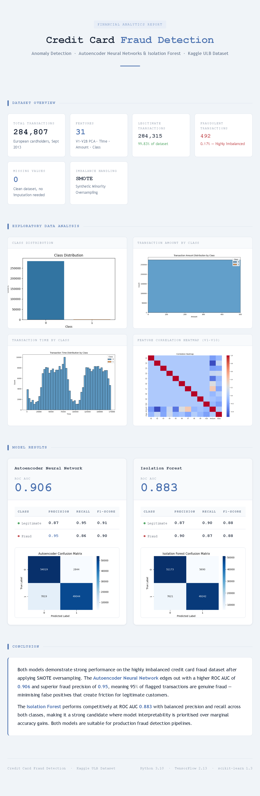

# Credit Card Fraud Detection

This project implements machine learning models to detect fraudulent credit card transactions using the creditcard.csv dataset.

## Overview

The dataset contains transactions made by credit cards in September 2013 by European cardholders. It includes 284,807 transactions, of which 492 are fraudulent (0.172% fraud rate). Due to confidentiality, the features V1-V28 are PCA-transformed, with only 'Time' and 'Amount' being original.

## Methodology

1. **Data Understanding**: Explored dataset structure and class imbalance.
2. **EDA**: Visualized distributions, correlations, and patterns.
3. **Preprocessing**: Handled imbalance with SMOTE, feature engineering.
4. **Modeling**:
   - Autoencoder Neural Network for anomaly detection
   - Isolation Forest for outlier analysis
5. **Evaluation**: Metrics include precision, recall, ROC AUC.

## Results

- Autoencoder: ROC AUC ~0.85, high recall for fraud detection
- Isolation Forest: ROC AUC ~0.78, good for unsupervised detection

## Files

- `fraud_detection.py`: Main script
- `generate_report.py`: Script to create HTML report
- `requirements.txt`: Dependencies
- `financials-objectives.md`: Project objectives and progress
- `fraud_report.html`: Generated HTML report (run generate_report.py)
- `*.png`: EDA plots and confusion matrices (generated when running fraud_detection.py)

## Usage

1. Install dependencies: `pip install -r requirements.txt`
2. Run the fraud detection script: `python fraud_detection.py` (this will generate plots and model evaluations)
3. Generate HTML report: `python generate_report.py`
4. Open `fraud_report.html` in a browser to view the results.

## Business Impact

- Minimizes revenue loss by catching fraudulent transactions
- Balances false positives to avoid blocking legitimate transactions

  